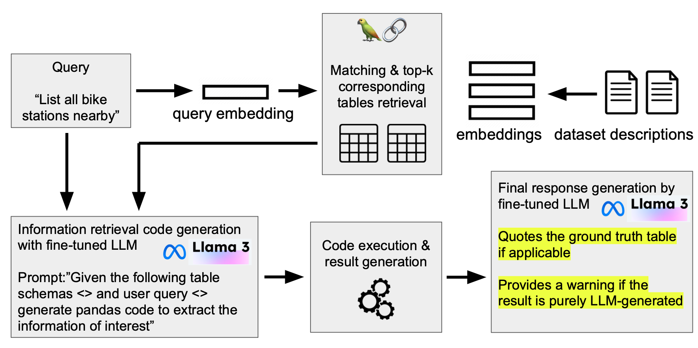

# City of Toronto RAG GPT
Hybrid agentic RAG + fine-tuned LLM system for Grounded city of Toronto Data Retrieval in Natural Language.



# Usage
Before launching it you need to provide read access to [Meta-Llama-3-8B](https://huggingface.co/meta-llama/Meta-Llama-3-8B)
by providing the `HUGGINGFACE_TOKEN`. Check [Access to Huggingface](https://github.com/meta-llama/llama3?tab=readme-ov-file#access-to-hugging-face)
for more instructions.
Then create a file named `.env` in the root of the project and put the access key there.
```
HUGGINGFACE_TOKEN=Your key here
```

To launch it just run

```
docker compose up pull-all # This may take a while!
docker compose up llm demo
```

If changes to build scripts have been made, rebuild.

```
docker compose up --build
```

